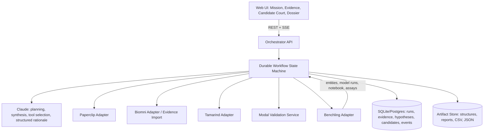

# BioForge Judge

## Claude Code Build Brief, Architecture, and Exact Prompt

**One-line pitch:** BioForge Judge researches a disease target, proposes antibody candidates, tries to prove each candidate is a bad choice, redesigns near-misses, and produces an evidence-backed shortlist for laboratory testing.

**Plain-language problem:** Biotech teams can create thousands of possible drug candidates but can test only a small number in a real laboratory. Choosing the wrong candidates wastes weeks, expensive materials, and scientist time. BioForge Judge reduces that waste by challenging candidates with several independent computer checks before recommending which ones deserve real experiments.

**Hackathon promise:** This system does not claim to discover a validated medicine. It produces a reproducible, computationally prioritized shortlist and an experiment-ready handoff.

---

## 1. MVP use case

A scientist provides:

- A protein target or antigen
- A target structure or PDB identifier
- An epitope or region of interest
- A target product profile, such as desired binder format and acceptable risk thresholds

BioForge Judge then:

1. Collects literature, protein, clinical, and regulatory evidence.
2. Creates explicit, falsifiable design hypotheses.
3. Generates or imports 12–20 antibody or nanobody candidates.
4. Evaluates every candidate using several independent tests.
5. Rejects candidates with binding, structural, mutation-robustness, or developability problems.
6. Redesigns one promising near-miss.
7. Produces a shortlist of up to three candidates.
8. Creates a Benchling-ready candidate record, validation protocol, plate map, and audit report.

### Default demo scenario

Use **VEGF-A** as the seeded demo target because it has public structures, known binders, and understandable biology. Include a known binder as a positive control and deliberately damaged or unrelated sequences as negative controls. Label all generated results as predictions.

The default demo must work without external credentials by using clearly labeled, deterministic fixture data. Live integrations activate when credentials are present.

---

## 2. Product experience

The UI should tell a story rather than look like a generic chatbot.

### Screen 1: Mission Control

- Target name and structure
- Epitope selection or textual epitope description
- Product requirements
- `Start Investigation` button
- Live workflow status

### Screen 2: Evidence Board

- Evidence cards with source, claim, citation, relevance, and confidence
- Contradictory evidence displayed prominently
- Source filters: literature, protein database, regulatory, clinical trial, internal record
- A clear distinction between observed facts, database annotations, and model predictions

### Screen 3: Hypothesis Ledger

For every hypothesis, show:

- Hypothesis statement
- Supporting evidence
- Contradicting evidence
- Planned test
- Result
- Confidence before and after the test
- Status: proposed, testing, survives, rejected, or uncertain

Do not display hidden model chain-of-thought. Display concise, structured scientific rationales and decision provenance.

### Screen 4: Candidate Court

Display 12–20 candidate cards moving through four gates:

1. Predicted binding
2. Independent structural agreement
3. Developability
4. Mutation robustness and negative-control challenge

Each candidate must show:

- Overall status
- Scores with units or documented scales
- Passed and failed gates
- Rejection reason
- Evidence and tool provenance
- Parent candidate if redesigned

Include a prominent `Challenge Survivors` action. It runs adverse tests, rejects weak survivors, and selects one near-miss for redesign.

### Screen 5: Decision Dossier

- Up to three recommended candidates
- Why each survived
- Remaining uncertainty
- What evidence would reverse the decision
- Suggested wet-lab validation
- Downloadable JSON, Markdown report, CSV score table, and liquid-handler plate map
- Benchling record links when the live integration is enabled

---

## 3. Architecture



### Tool responsibilities

| Tool | Primary responsibility | Required artifact |
|---|---|---|
| Anthropic Claude Platform | Plan the investigation, select tools, compare evidence, update hypotheses, generate structured rationales | Tool-call trace and decision records |
| Paperclip | Search literature, FDA documents, trials, UniProt, PDB, and related scientific sources | Cited evidence bundle |
| Biomni Labs | Target biology, homologs, pathways, BLAST/database analysis, supplemental bioinformatics | Exported evidence/analysis manifest |
| Tamarind Bio | Candidate generation or import, structure prediction, binding/developability scoring | Candidate structures and prediction results |
| Benchling Model Hub | Independent structure prediction using a different model from the design path | Independent validation result |
| Modal | Parallel validator execution, negative controls, mutation scan, score aggregation, and API hosting | Per-candidate validation matrix |
| Benchling | Scientific system of record for sequences, results, lineage, protocol, and final experiment package | Registered candidate records and notebook entry |

### Important integration rule

Do not invent undocumented endpoints. Every integration must implement a shared adapter interface and support:

- `live` mode using an official SDK, API, CLI, or MCP connection
- `fixture` mode using deterministic hackathon data
- Explicit provenance showing which mode produced each result

If Biomni does not expose an automation interface available to the team, support a deliberate handoff: generate a Biomni task prompt, accept its exported result files, parse them, and record the import in the audit trail. This is preferable to pretending an integration exists.

---

## 4. Workflow state machine

Use an explicit state machine, not an open-ended chat loop.

```text
CREATED
  -> EVIDENCE_GATHERING
  -> HYPOTHESES_CREATED
  -> CANDIDATES_READY
  -> PRIMARY_TESTING
  -> INDEPENDENT_VALIDATION
  -> ADVERSARIAL_CHALLENGE
  -> REDESIGNING (zero or one MVP iteration)
  -> FINAL_REVIEW
  -> PACKAGE_CREATED
  -> COMPLETED

Any state may transition to NEEDS_REVIEW or FAILED.
```

Every transition must produce an immutable event containing:

- Run ID
- Timestamp
- Previous and next state
- Tool or human responsible
- Input artifact IDs
- Output artifact IDs
- Model/tool version
- Parameters and random seed where applicable
- Short rationale
- Error or warning information

---

## 5. Core data contracts

Use Pydantic or equivalent typed schemas.

### Investigation

```json
{
  "id": "run_001",
  "target": {
    "name": "VEGF-A",
    "uniprot_id": "P15692",
    "pdb_id": "optional",
    "epitope_description": "user supplied"
  },
  "target_product_profile": {
    "format": "nanobody",
    "max_candidates": 20,
    "max_finalists": 3,
    "constraints": []
  },
  "mode": "fixture_or_live",
  "status": "EVIDENCE_GATHERING"
}
```

### Evidence item

```json
{
  "id": "ev_001",
  "claim": "Concise claim supported by the source",
  "source_type": "paper|database|regulatory|trial|benchling|analysis",
  "source_title": "Source title",
  "source_url": "https://...",
  "citation_locator": "section, page, accession, or record ID",
  "support": "supports|contradicts|context_only",
  "evidence_level": "observed|reported|annotated|predicted",
  "relevance": 0.0,
  "confidence": 0.0,
  "tool": "paperclip",
  "retrieved_at": "ISO-8601 timestamp"
}
```

### Hypothesis

```json
{
  "id": "hyp_001",
  "statement": "Candidate binding to the selected epitope will block the intended interaction while retaining acceptable developability",
  "falsification_criteria": [],
  "supporting_evidence_ids": [],
  "contradicting_evidence_ids": [],
  "planned_tests": [],
  "prior_confidence": 0.0,
  "posterior_confidence": 0.0,
  "status": "proposed|testing|survives|rejected|uncertain"
}
```

### Candidate and test result

```json
{
  "id": "BF-017",
  "name": "BF-017",
  "sequence": "AMINO_ACID_SEQUENCE",
  "format": "nanobody",
  "parent_id": null,
  "generation_tool": "tamarind_or_fixture",
  "status": "active|rejected|survives|recommended",
  "tests": [
    {
      "gate": "developability",
      "metric": "surface_hydrophobicity",
      "value": 0.31,
      "threshold": 0.45,
      "direction": "lower_is_better",
      "passed": true,
      "tool": "tamarind",
      "model_version": "record_exact_version",
      "artifact_ids": [],
      "rationale": "Value is within the configured acceptance range"
    }
  ],
  "decision": {
    "outcome": "reject|redesign|advance",
    "reason_codes": [],
    "summary": "Short evidence-based explanation",
    "uncertainties": [],
    "reversal_conditions": []
  }
}
```

---

## 6. Candidate scoring and scientific guardrails

Do not let Claude invent a single unexplained score. Store raw metrics and apply a transparent configuration-driven decision policy.

Example MVP policy:

```yaml
gates:
  binding:
    required: true
    metrics:
      - name: interface_confidence
        minimum: 0.65
  independent_structure:
    required: true
    metrics:
      - name: model_agreement
        minimum: 0.60
  developability:
    required: true
    max_failed_metrics: 1
  robustness:
    required: true
    metrics:
      - name: retained_score_across_mutations
        minimum: 0.55
```

The exact thresholds must be visibly labeled as demonstration thresholds unless supported by a cited source or validated internal dataset.

Required guardrails:

- Never state that a candidate is experimentally validated when it is only predicted.
- Never hide conflicting evidence.
- Separate facts, literature claims, database annotations, and predictions.
- Record failures and timeouts instead of silently substituting fabricated results.
- Require human approval before any real Benchling write; fixture mode may write to the local demo store automatically.
- Do not expose private chain-of-thought. Provide structured rationales, evidence links, and tool provenance.
- Generated sequences are research candidates, not medical advice or ready-to-administer therapies.

---

## 7. Validation plan

### Retrospective benchmark

For at least three public antigen–antibody complexes:

1. Add the known binder as a positive control.
2. Add an unrelated binder as a negative control.
3. Create a shuffled-CDR negative control.
4. Create one or more interface-disrupting mutants.
5. Blind the pipeline to the labels.
6. Evaluate whether the system ranks positive controls above negatives.

Report:

- Positive-control rank
- Top-k enrichment
- AUROC when the sample count permits it
- Number of candidates rejected at each gate
- Agreement between primary and independent models
- Performance over at least three random seeds
- Runtime and approximate compute/API cost

### Required ablations

- Without the independent structure model
- Without the developability gate
- Without adversarial mutation testing

The result should demonstrate why the full workflow is better than a single model score.

### Seeded demo behavior

The fixture dataset should yield a compelling but honest narrative:

- 16 starting candidates
- 6 fail binding
- 3 fail independent structural agreement
- 2 fail developability
- 2 fail adversarial mutation or decoy testing
- 3 survive
- 1 near-miss is redesigned
- The redesign improves one metric without unrealistically improving every metric

---

## 8. Recommended repository structure

```text
bioforge-judge/
  README.md
  Makefile
  .env.example
  docker-compose.yml
  apps/
    web/                         # Next.js + TypeScript UI
    api/                         # FastAPI orchestration API
  packages/
    schemas/                     # Shared JSON Schema/OpenAPI types
  services/
    modal_validator/             # Modal functions and endpoint
  adapters/
    base.py
    anthropic_adapter.py
    paperclip_adapter.py
    biomni_adapter.py
    tamarind_adapter.py
    benchling_adapter.py
    fixture_adapter.py
  engine/
    state_machine.py
    workflow.py
    decision_policy.py
    hypothesis_ledger.py
    audit.py
  data/
    fixtures/
    demo/
  tests/
    unit/
    integration/
    benchmark/
  artifacts/                     # Generated locally; gitignored except samples
  docs/
    architecture.md
    demo-script.md
    scientific-limitations.md
```

### Suggested stack

- Frontend: Next.js, TypeScript, Tailwind, a restrained component library, and Recharts
- Backend: Python 3.12, FastAPI, Pydantic, SQLAlchemy, SQLite for demo
- Live updates: Server-Sent Events
- Orchestration: explicit Python state machine; do not introduce a heavy workflow framework unless already present
- LLM: Anthropic Python SDK with typed tool schemas and structured JSON outputs
- Compute: Modal functions exposed through a small authenticated endpoint
- Tests: pytest for backend and Playwright or Vitest for the core UI path
- Packaging: Docker Compose plus a simple `make demo`

If an existing repository already uses a reasonable stack, preserve it instead of rewriting the project around this suggestion.

---

## 9. API surface

Minimum endpoints:

```text
POST   /api/investigations
GET    /api/investigations/{run_id}
POST   /api/investigations/{run_id}/start
GET    /api/investigations/{run_id}/events
GET    /api/investigations/{run_id}/evidence
GET    /api/investigations/{run_id}/hypotheses
GET    /api/investigations/{run_id}/candidates
POST   /api/investigations/{run_id}/challenge
POST   /api/investigations/{run_id}/redesign/{candidate_id}
POST   /api/investigations/{run_id}/approve-benchling-write
GET    /api/investigations/{run_id}/dossier
GET    /api/investigations/{run_id}/artifacts/{artifact_id}
GET    /api/health
```

The `events` endpoint should stream state transitions and tool events to make the workflow feel alive during the demo.

---

## 10. Environment variables

```dotenv
APP_MODE=fixture
DATABASE_URL=sqlite:///./bioforge.db
ANTHROPIC_API_KEY=
ANTHROPIC_MODEL=
PAPERCLIP_API_KEY=
TAMARIND_API_KEY=
BENCHLING_TENANT=
BENCHLING_API_KEY=
BENCHLING_MCP_URL=
MODAL_VALIDATOR_URL=
MODAL_TOKEN_ID=
MODAL_TOKEN_SECRET=
```

Never commit secrets. The application must boot in fixture mode with no credentials.

---

## 11. Definition of done

The MVP is done when:

- `make demo` starts the UI and API with no credentials.
- The seeded VEGF-A investigation completes end to end.
- The UI visibly progresses through evidence, hypotheses, candidate gates, challenge, redesign, and dossier creation.
- At least one candidate is rejected for each major type of failure across the fixture set.
- Every claim and score exposes provenance.
- Candidate decisions are reproducible from stored raw metrics and configuration.
- The final dossier downloads as Markdown and JSON.
- A candidate table and plate map download as CSV.
- Live adapters are cleanly separated from fixture adapters.
- At least one sponsor integration is demonstrated live if credentials permit, with all remaining integrations represented by working adapters or explicit import handoffs.
- Tests cover state transitions, gate logic, provenance requirements, and failure behavior.
- The README contains a 3-minute demo script and a scientific limitations section.

---

## 12. Three-minute demo script

1. **Problem, 20 seconds:** “Teams can generate thousands of drug candidates but can afford to test only a few. Picking badly wastes weeks.”
2. **Start, 20 seconds:** Select VEGF-A, a target region, and nanobody format. Click `Start Investigation`.
3. **Evidence, 25 seconds:** Show cited evidence and one contradiction. Emphasize observed versus predicted evidence.
4. **Generation, 20 seconds:** Sixteen candidates appear with lineage and provenance.
5. **Candidate Court, 45 seconds:** Candidates fail different gates. Open one rejection and show the exact test and threshold.
6. **Challenge, 30 seconds:** Click `Challenge Survivors`; introduce mutations and decoys. One survivor is rejected.
7. **Redesign, 25 seconds:** Redesign a near-miss and show a specific metric improve while another stays unchanged or worsens slightly.
8. **Handoff, 15 seconds:** Open the final dossier, Benchling-ready records, assay plan, and plate map.

Closing line:

> “BioForge Judge does not just propose molecules. It tries to prove itself wrong and shows scientists exactly why a candidate deserves—or does not deserve—a real experiment.”

---

## 13. Exact prompt for Claude Code

Copy everything inside the block below into Claude Code from the repository root.

```text
You are the lead engineer and scientific software architect for a hackathon project called BioForge Judge.

Your task is to build a polished, working MVP—not merely write a plan.

PRODUCT GOAL
BioForge Judge helps a biotech team choose which antibody or nanobody candidates are worth testing in a real laboratory. Given a protein target, epitope, and target product profile, it gathers evidence, creates falsifiable hypotheses, generates or imports candidates, evaluates them through independent gates, challenges the survivors, redesigns one near-miss, and produces an auditable experiment-ready package.

The product must never claim that a computational prediction is experimental validation. Its central differentiator is adversarial self-correction: it tries to prove its own candidates wrong before recommending them.

FIRST ACTIONS
1. Inspect the existing repository, including README, package files, environment configuration, tests, and any AGENTS.md or CLAUDE.md instructions.
2. Preserve all useful existing work and conventions. Do not replace a working stack without a concrete reason.
3. Read the file outputs/BioForge_Judge_Claude_Code_Build_Brief.md in full and treat it as the product specification.
4. Produce a short implementation checklist, then immediately implement it. Do not stop after planning.
5. Use reasonable defaults instead of asking questions unless a missing decision makes implementation unsafe or impossible.

MVP REQUIREMENTS
- A polished web UI with five views: Mission Control, Evidence Board, Hypothesis Ledger, Candidate Court, and Decision Dossier.
- A FastAPI or existing-equivalent backend with an explicit durable workflow state machine.
- Server-Sent Events or the existing project’s equivalent for live progress.
- Deterministic fixture mode that works with no API credentials.
- A seeded VEGF-A demo with 16 candidates, positive and negative controls, several rejection reasons, three survivors, and one redesign.
- Adapter interfaces for Anthropic, Paperclip, Biomni, Tamarind, Benchling, Modal, and fixtures.
- Live integrations only through official SDKs, APIs, CLIs, or MCP connections. Do not invent endpoints or fabricate successful tool results.
- If a live service is unavailable, visibly mark the fixture or import-handoff mode in the UI and provenance record.
- Transparent, configuration-driven decision gates. Store raw scores; do not ask the LLM to invent an unexplained aggregate score.
- Immutable audit events for state transitions and tool activity.
- Downloadable Markdown and JSON dossier, CSV score table, and CSV plate map.
- Human approval immediately before any live write to Benchling.
- No hidden chain-of-thought display. Show structured rationales: hypothesis, evidence, test, result, uncertainty, decision, and reversal condition.

WORKFLOW
CREATED -> EVIDENCE_GATHERING -> HYPOTHESES_CREATED -> CANDIDATES_READY -> PRIMARY_TESTING -> INDEPENDENT_VALIDATION -> ADVERSARIAL_CHALLENGE -> REDESIGNING (maximum one MVP iteration) -> FINAL_REVIEW -> PACKAGE_CREATED -> COMPLETED.
Any step can transition to NEEDS_REVIEW or FAILED.

CANDIDATE GATES
1. Predicted binding
2. Independent structural agreement
3. Developability
4. Mutation robustness and negative-control challenge

Each candidate must show raw metrics, thresholds, pass/fail status, tool and model provenance, artifact links, rejection or advancement reason, uncertainty, and what evidence would reverse the decision.

DATA MODEL
Implement typed models for Investigation, EvidenceItem, Hypothesis, Candidate, TestResult, Decision, Artifact, AuditEvent, and IntegrationStatus using the schemas in the build brief. Generate stable IDs and timestamps. Include model/tool version, parameters, and random seed wherever applicable.

INTEGRATIONS
- Claude: workflow planning, evidence synthesis, structured hypothesis updates, and concise decision rationales using typed tool schemas and structured outputs.
- Paperclip: scientific literature, FDA, clinical-trial, UniProt, PDB, and related evidence with citations.
- Biomni: target context and bioinformatics analysis; if there is no accessible official programmatic interface, generate a task prompt and implement a result-file import with provenance.
- Tamarind: candidate design/import, prediction, and developability scores.
- Benchling Model Hub: independent structure check using a different model from the design path.
- Modal: parallel validation, mutation/decoy challenge, score aggregation, and hosted validator endpoint.
- Benchling: candidate sequences, assay-like prediction records, lineage, notebook report, and experiment plan.

Implement fixture adapters first so the end-to-end product is always demoable. Then implement live adapters to the extent permitted by installed SDKs, available documentation, and credentials. Live integration failures must degrade gracefully and visibly; they must never silently fall back while claiming a live result.

SCIENTIFIC VALIDATION
Create a small benchmark harness containing known positive controls, unrelated binders, shuffled-CDR negatives, and interface-disrupting mutants. Blind the pipeline to labels until evaluation. Report positive-control rank, top-k enrichment, gate rejection counts, primary/independent model agreement, runtime, seed, and approximate cost. Include ablation placeholders or implementations for removing the independent structure check, developability gate, and adversarial challenge.

UX DIRECTION
Do not build a generic chatbot. Candidate Court is the visual centerpiece. Make status changes easy to follow, rejections visually clear, citations accessible, and predictions unmistakably labeled. Add a prominent Challenge Survivors action and an animated but professional workflow timeline. Optimize the entire experience for a three-minute live demo.

ENGINEERING QUALITY
- Keep the architecture simple and understandable.
- Add .env.example and never commit credentials.
- Add useful error states, retry behavior, and integration-status indicators.
- Add tests for state transitions, decision gates, provenance, fixture determinism, and tool failure behavior.
- Add a Makefile or equivalent with setup, dev, test, and demo commands.
- Add README instructions that a teammate can follow from a clean checkout.
- Add docs/architecture.md, docs/demo-script.md, and docs/scientific-limitations.md.
- Run formatting, type checking, tests, and the production build. Fix failures before stopping.
- If browser-testing tools are available, execute the full seeded demo and fix visible usability problems.

DELIVERY
Continue until the fixture-mode MVP runs end to end. At the end, report:
1. What was built
2. Exact commands to run it
3. Tests and build checks executed
4. Which integrations are live versus fixture or import-handoff
5. Required credentials and setup for remaining live integrations
6. Known scientific and engineering limitations
7. The recommended three-minute demo path

Begin by inspecting the repository and reading the build brief. Then implement the product.
```

---

## 14. Suggested follow-up prompts for Claude Code

After the first build completes, use these one at a time.

### Scientific audit

```text
Audit BioForge Judge as a skeptical computational biologist. Identify every place where the UI or report could overstate a prediction, obscure conflicting evidence, use an unjustified threshold, or confuse model agreement with experimental validity. Implement fixes, add tests, and update the scientific limitations document. Do not merely produce recommendations.
```

### Demo polish

```text
Run the complete seeded demo as if presenting to hackathon judges with only three minutes. Remove friction, fix unclear language, make tool provenance and candidate rejection reasons immediately understandable, and ensure the Challenge Survivors and redesign moments are visually memorable. Preserve scientific honesty. Re-run tests and the production build.
```

### Live integration pass

```text
Inspect the current integration adapters and environment. Using only official installed SDKs, documented APIs, CLIs, or MCP connections, activate as many live integrations as available. Do not invent API behavior. Add integration health checks, precise setup instructions, graceful failure states, and contract tests. Never print or commit secrets.
```

